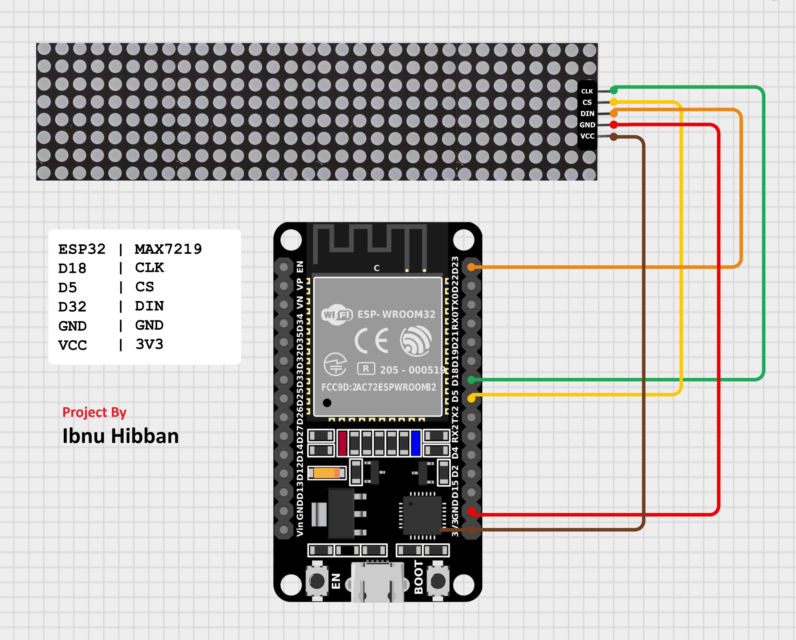
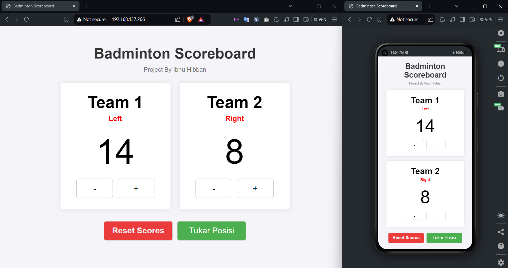
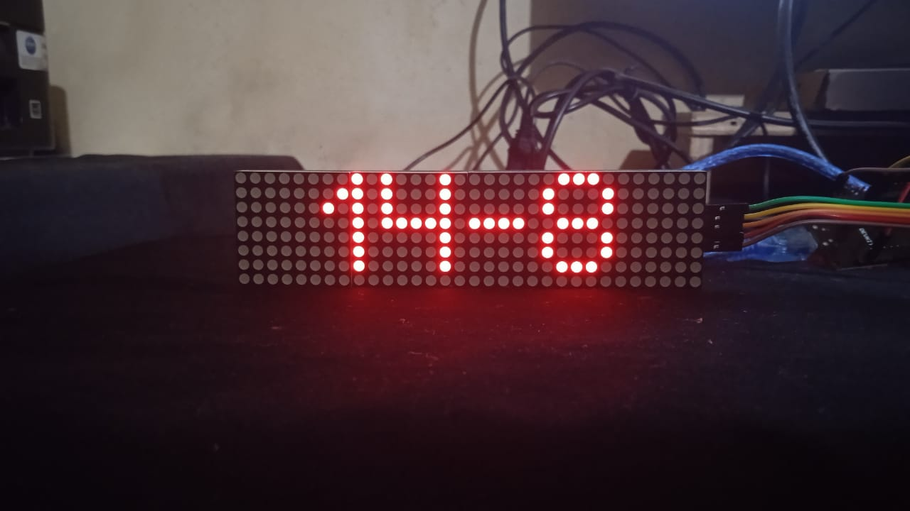

# Badminton Score

This project uses an ESP32 DevKit V1 and an LED matrix MAX7219 to display badminton scores in real-time.

## Table of Contents
1. [Project Description](#project-description)
2. [Features](#features)
3. [Requirements](#requirements)
4. [Installation](#installation)
5. [Usage](#usage)
6. [Documentation Images](#documentation-images)
7. [Contribution](#contribution)
8. [License](#license)

## Project Description
This project aims to create a scoreboard system for badminton games using an ESP32 DevKit V1 and an LED matrix MAX7219. The system allows users to monitor scores in real-time through a clear and readable LED display.

## Features
- Display real-time badminton scores
- Score adjustment via web interface
- Clear and bright LED matrix display

## Requirements
- ESP32 DevKit V1
- LED matrix MAX7219 4 in 1
- Jumper wires
- Arduino IDE software

## Installation
1. Clone this repository:
    ```bash
    git clone https://github.com/ibnuhibbann/Badminton-Score-ESP32-LED-Matrix.git
    ```
2. Install the required libraries in the Arduino IDE:
    - `MD_Parola`
    - `MD_MAX72XX`
    - `SPI`
    - `WiFi`
    - `WebServer`

3. Connect the hardware according to the pin diagram below:
   
   

4. Open the `.ino` file in the Arduino IDE and upload it to the ESP32 DevKit V1.

## Usage
1. Power on the ESP32 DevKit V1.
2. Connect to the Wi-Fi network with the credentials specified in the code.
3. Open a web browser and navigate to the IP address displayed on the LED matrix.
4. Use the web interface to adjust the scores.

## Documentation Images
Below are some images demonstrating the project:

1. **Web Server Interface for Score Adjustment:**
   
   

2. **LED Matrix Displaying the Score:**
   
   

